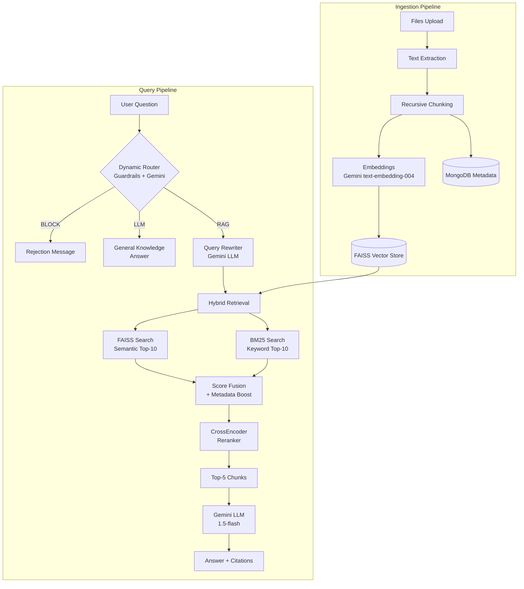
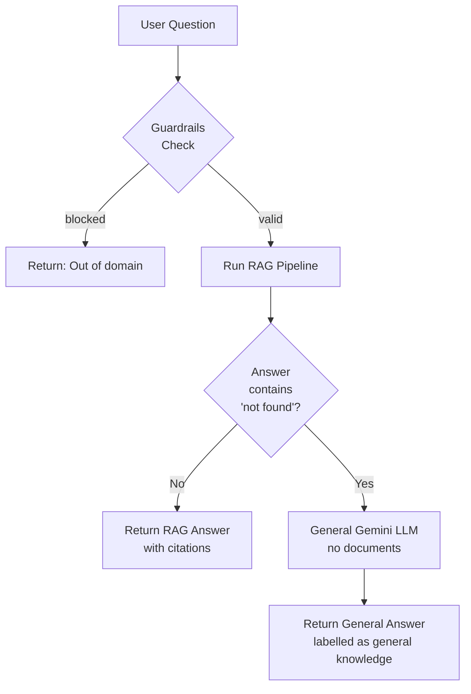

# InsightFlow AI — Enterprise RAG Knowledge Assistant

<div align="center">
  <h1>🧠 InsightFlow AI</h1>
  <p><strong>Production-grade Enterprise Knowledge Assistant powered by Advanced RAG</strong></p>
  <p>
    
    
    
    
    
  </p>
</div>

---

## 📋 Table of Contents

- [Overview](#overview)
- [System Architecture](#system-architecture)
- [Pipeline Deep Dive](#pipeline-deep-dive)
  - [1. Ingestion Pipeline](#1-ingestion-pipeline)
  - [2. Query Pipeline](#2-query-pipeline)
  - [3. Smart Fallback Flow](#3-smart-fallback-flow)
- [Tech Stack](#tech-stack)
- [System Modules](#system-modules)
- [Setup & Local Development](#setup--local-development)

---

## Overview

InsightFlow AI is an advanced internal knowledge assistant that enables organizations to securely upload documents (PDFs, DOCX, PPTX, TXT) and ask natural language questions. It utilizes a **multi-stage Advanced RAG pipeline** to provide highly accurate, citation-backed answers grounded purely in the uploaded enterprise knowledge base.

### Advanced Features

- 🛡️ **Intelligent Guardrails**: Automatic routing of queries (Blocklist, RAG knowledge, or General LLM knowledge).
- ✍️ **Query Rewriting**: Gemini-powered query expansion to improve search recall.
- 🔍 **Hybrid Retrieval**: Combines **FAISS Semantic Search** with **BM25 Keyword Search** for unmatched accuracy.
- ⚖️ **Cross-Encoder Reranking**: Re-orders retrieved documents based on deep semantic relevance.
- 📄 **Document Ingestion**: Auto-chunking, embeddings generation, and summarization.
- 🤖 **Grounded Generation**: Answers generated by Gemini, strictly constrained to retrieved context with exact source citations.
- 🔐 **Role-Based Access Control (RBAC)**: Employee, Manager, and Admin roles with JWT authentication.
- 🏢 **Department Filtering**: Metadata-level security to ensure users only retrieve documents meant for their department.

---

## System Architecture

### Full-Stack Architecture Roles

The InsightFlow AI platform is built on a decoupled, scalable architecture separating the user interface from the heavy AI processing logic.

#### 🖥️ Frontend Role (React + Vite)
- **User Interface & Experience**: Provides a responsive, modern interface for employees, managers, and admins built with React 18, Tailwind CSS, and ShadCN UI.
- **State Management & Caching**: Uses React Query for efficient data fetching, caching, and background synchronization of chat history and analytics.
- **Real-Time Interactions**: Handles real-time streaming of LLM responses via Server-Sent Events (SSE) so users see answers generated token-by-token.
- **Data Visualization**: Renders interactive analytics dashboards using Recharts to visualize query trends and department activity.

#### ⚙️ Backend Role (FastAPI)
- **API Gateway**: Exposes highly concurrent, async RESTful endpoints for the frontend to interact with using FastAPI.
- **Security & RBAC**: Manages JWT-based authentication, verifying user permissions, and enforcing role-based access control (Admin, Manager, Employee) on every request.
- **Orchestration**: Serves as the central hub connecting the MongoDB metadata store, the local FAISS vector store, and external Gemini API.
- **Heavy Lifting (RAG Agent)**: Executes the advanced multi-stage RAG pipeline (Document extraction, hybrid retrieval, cross-encoder reranking, LLM answer generation) efficiently on the server.

### High-Level Overview

```text
╔══════════════════════════════════════════════════════════════════════╗
║                        RAG AGENT SYSTEM                             ║
╠══════════════════════╦═══════════════════════════════════════════════╣
║   INGESTION LAYER    ║              QUERY LAYER                     ║
║                      ║                                               ║
║  PDF/DOCX Files      ║   User Question                              ║
║      │               ║        │                                      ║
║      ▼               ║        ▼                                      ║
║  Text Extraction     ║   ① Dynamic Router ─(BLOCK)──→ Reject        ║
║  (Multi-format)      ║        │   └──(LLM)──→ General LLM Answer    ║
║      │               ║        ▼ (RAG)                                ║
║      ▼               ║   ② Query Rewriting (Gemini LLM)             ║
║  Chunking            ║        │                                      ║
║  (700 char, 100 ovlp)║        ▼                                      ║
║      │               ║   ③ Hybrid Retrieval                         ║
║      ▼               ║   ┌──────────┬──────────┐                    ║
║  Embeddings          ║   │  FAISS   │   BM25   │                    ║
║  (text-embedding-004)║   │ semantic │ keyword  │                    ║
║      │               ║   └────┬─────┴─────┬────┘                    ║
║      ▼               ║        │  Fusion   │                          ║
║  FAISS Vector Store  ║        ▼ + Metadata Boost                    ║
║                      ║   ④ CrossEncoder Reranking                   ║
║                      ║        │                                      ║
║                      ║        ▼                                      ║
║                      ║   ⑤ Gemini Answer Generation                 ║
║                      ║        │                                      ║
║                      ║        ▼                                      ║
║                      ║   Answer + Source Citations                   ║
╚══════════════════════╩═══════════════════════════════════════════════╝
```

### Component Interaction Diagram



---

## Pipeline Deep Dive

### 1. Ingestion Pipeline

```text
Document File(s)
    │
    ▼
┌─────────────────────────────────────────┐
│         TEXT EXTRACTION                 │
│  • PyMuPDF (PDFs)                       │
│  • python-docx (Word docs)              │
│  • python-pptx (Presentations)          │
│  • Native Reader (TXT)                  │
└──────────────────┬──────────────────────┘
                   │
                   ▼
┌─────────────────────────────────────────┐
│         TEXT CLEANING                   │
│  • Remove headers/footers               │
│  • Normalize unicode & formatting       │
└──────────────────┬──────────────────────┘
                   │
                   ▼
┌─────────────────────────────────────────┐
│         CHUNKING ENGINE                 │
│  RecursiveCharacterTextSplitter         │
│  chunk_size    = 700 chars              │
│  chunk_overlap = 100 chars              │
└──────────────────┬──────────────────────┘
                   │ chunks[ {text, metadata, department} ]
                   ▼
┌─────────────────────────────────────────┐
│         EMBEDDING GENERATION            │
│  Model: models/text-embedding-004       │
│  Dimension: 768                         │
└──────────────────┬──────────────────────┘
                   │
                   ▼
┌─────────────────────────────────────────┐
│         FAISS INDEX                     │
│  Filtered by Department Metadata        │
└─────────────────────────────────────────┘
```

### 2. Query Pipeline

```text
User Question: "What are penalties for data breach under DPDP Act?"
    │
    ▼
┌─────────────────────────────────────────────────────────────────┐
│  STEP 1 — DYNAMIC ROUTER & GUARDRAILS                           │
│  Layer 1: Check against static blocked patterns                 │
│  Layer 2: Fast match against extracted keywords                 │
│  Layer 3: Gemini assigns intent (BLOCK, LLM, or RAG)            │
└──────────────────────────────┬──────────────────────────────────┘
                               │ (If RAG)
                               ▼
┌─────────────────────────────────────────────────────────────────┐
│  STEP 2 — QUERY REWRITING (Gemini LLM)                          │
│                                                                 │
│  Input:  "penalties for data breach under DPDP Act"             │
│  Output: "penalties for data breach under Digital Personal      │
│           Data Protection Act 2023"                             │
└──────────────────────────────┬──────────────────────────────────┘
                               │ rewritten_query
                               ▼
┌─────────────────────────────────────────────────────────────────┐
│  STEP 3 — HYBRID RETRIEVAL                                      │
│                                                                 │
│  ┌──────────────────────┐    ┌──────────────────────┐           │
│  │   FAISS (semantic)   │    │    BM25 (keyword)    │           │
│  │                      │    │                      │           │
│  │  Cosine similarity   │    │  TF-IDF scoring      │           │
│  │  Top-10 results      │    │  Top-10 results      │           │
│  └──────────┬───────────┘    └───────────┬──────────┘           │
│             │                            │                      │
│             └────────────┬───────────────┘                      │
│                          ▼                                      │
│              WEIGHTED SCORE FUSION                              │
│              FAISS weight: 0.7                                  │
│              BM25  weight: 0.3                                  │
│                          │                                      │
│                          ▼                                      │
│              Top-10 unique merged candidates                    │
└──────────────────────────┬──────────────────────────────────────┘
                           │
                           ▼
┌─────────────────────────────────────────────────────────────────┐
│  STEP 4 — CROSSENCODER RERANKING                                │
│                                                                 │
│  Model: cross-encoder/ms-marco-MiniLM-L-6-v2                    │
│                                                                 │
│  Scores every (query, chunk_text) pair jointly                  │
│  10 candidates in → Top 5 out (ranked by relevance)             │
└──────────────────────────┬──────────────────────────────────────┘
                           │ Top-5 reranked chunks
                           ▼
┌─────────────────────────────────────────────────────────────────┐
│  STEP 5 — GEMINI ANSWER GENERATION                              │
│                                                                 │
│  Model: gemini-1.5-flash                                        │
│                                                                 │
│  Rules: cite sources, use ONLY context, don't hallucinate       │
│  Output: Answer + [Source: dpdp.pdf, Page: 21]                  │
└──────────────────────────┬──────────────────────────────────────┘
                           │
                           ▼
          {answer, sources[], num_sources, rewritten_query}
```

### 3. Smart Fallback Flow



---

## Tech Stack

| Component | Technology | Details |
|---|---|---|
| **Frontend** | React 18, Vite, Tailwind CSS, ShadCN | Modern UI with SSE streaming chat |
| **Backend Framework** | FastAPI (Python 3.11) | High-performance async API |
| **LLM & Embeddings** | Google Gemini API | `gemini-1.5-flash` & `text-embedding-004` |
| **Vector Store** | FAISS | Local scalable semantic search |
| **Keyword Search** | BM25 (`rank-bm25`) | Exact keyword matching |
| **Reranker** | HuggingFace Cross-Encoder | `ms-marco-MiniLM-L-6-v2` |
| **Document Parsers** | PyMuPDF, python-docx, etc. | Cascade fallback for robustness |
| **Database** | MongoDB | Stores metadata, users, chat history |
| **Auth** | JWT (Access + Refresh) | RBAC (Employee, Manager, Admin) |

---

## System Modules

| # | Module | Description |
|---|--------|-------------|
| 1 | **Authentication** | JWT auth, password hashing, and user roles |
| 2 | **Document Ingestion** | Extracts text from PDF, DOCX, PPTX, TXT |
| 3 | **Chunking Engine** | Recursive character text splitter (700 chunk size, 100 overlap) |
| 4 | **Embeddings** | Gemini `text-embedding-004` (768 dimensions) |
| 5 | **Vector Indexing** | FAISS local vector store + metadata filters |
| 6 | **Guardrails** | Static blocklists and Gemini-based query routing |
| 7 | **Query Rewriter** | Expands abbreviations and clarifies context |
| 8 | **Hybrid Retrieval** | Semantic search (70%) + Keyword BM25 (30%) + Metadata boost |
| 9 | **Reranking Layer** | Local Cross-Encoder model to accurately score Top-10 candidates |
| 10 | **Generation** | Gemini `1.5-flash` strictly grounded to retrieved context |
| 11 | **Citation Engine** | Maps text chunks back to original documents and page numbers |
| 12 | **Analytics & History** | Tracks queries, confidence scores, and usage trends in MongoDB |

---

## Setup & Local Development

### 1. Environment Configuration
Copy the sample environment file and add your Gemini API Key and MongoDB URL.
```bash
cp .env.example .env
```

Ensure your `.env` contains:
```env
GEMINI_API_KEY=your_google_ai_studio_key
MONGODB_URL=mongodb://localhost:27017
```

### 2. Backend Setup
The backend requires Python 3.11+.
```bash
cd backend
python3 -m venv venv
source venv/bin/activate
pip install -r requirements.txt

# Start the FastAPI server on http://localhost:8000
uvicorn main:app --reload
```

### 3. Frontend Setup
The frontend requires Node.js 18+.
```bash
cd frontend
npm install

# Start the Vite dev server on http://localhost:5173
npm run dev
```

## License

MIT
