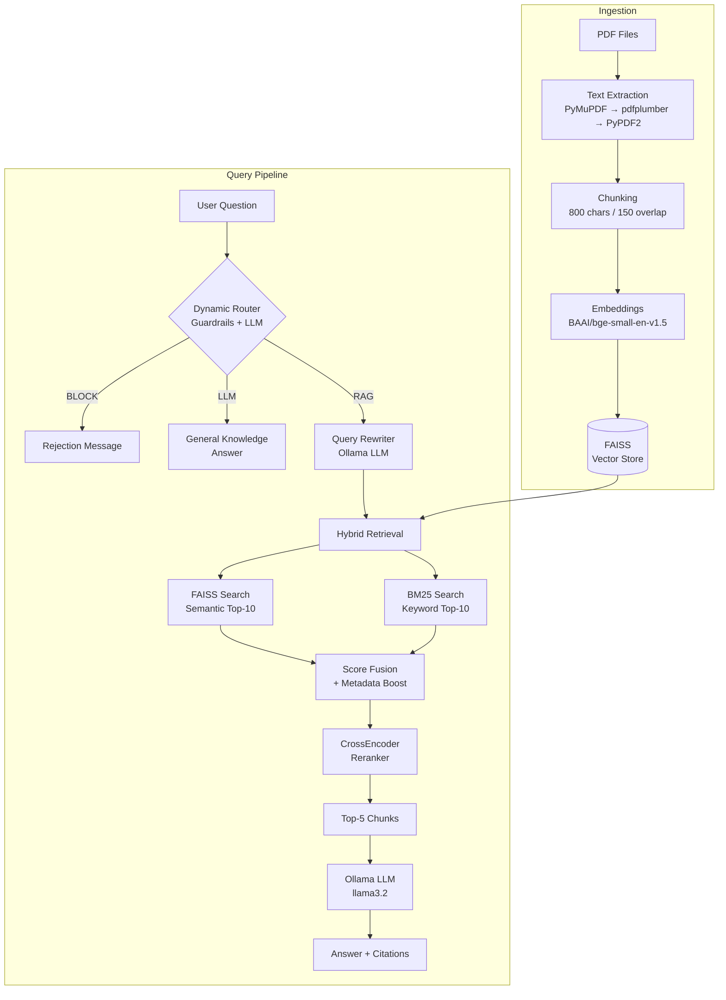
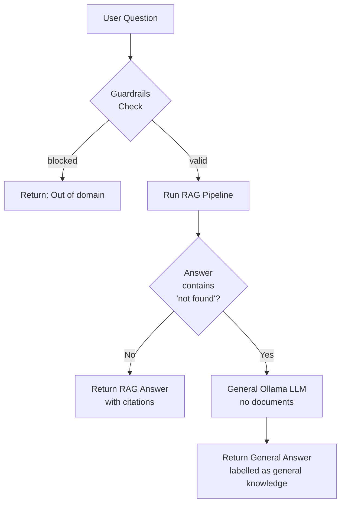

# 🤖 Advanced RAG Agent — Legal Document Intelligence System

> A production-grade **Retrieval-Augmented Generation** pipeline that ingests PDF documents, performs **hybrid semantic + keyword retrieval**, applies **CrossEncoder reranking**, rewrites queries with an LLM, and generates precise answers with source citations — powered by a **Fully Local Ollama LLM** for absolute privacy.

---
## Improvement sot be done:
give the date of information when answers using llm because it maybe out of date


## 📋 Table of Contents

- [What's New — Advanced Pipeline](#whats-new--advanced-pipeline)
- [System Architecture](#system-architecture)
- [Pipeline Deep Dive](#pipeline-deep-dive)
  - [Ingestion Pipeline](#1-ingestion-pipeline)
  - [Query Pipeline](#2-query-pipeline)
- [Module Reference](#module-reference)
- [Tech Stack](#tech-stack)
- [Project Structure](#project-structure)
- [Setup Guide](#setup-guide)
- [How to Run](#how-to-run)
- [Example Queries](#example-queries)
- [Programmatic Usage](#programmatic-usage)
- [Configuration Reference](#configuration-reference)
- [Input & Output Formats](#input--output-formats)
- [Testing](#testing)
- [Troubleshooting](#troubleshooting)

---

## What's New — Advanced Pipeline

| Feature | Old Pipeline | New Pipeline |
|---|---|---|
| **LLM** | Groq Cloud | ✅ **Local Ollama** `llama3.2` (100% private, fully local inference) |
| **Retrieval** | FAISS similarity only | ✅ **Hybrid FAISS + BM25** (semantic + keyword) |
| **Query rewriting** | ❌ None | ✅ **LLM rewrites** query before retrieval |
| **Input guardrails** | ❌ None | ✅ **Dynamic Router**: 3-layer guardrail and LLM routing |
| **Keyword Extraction** | ❌ None | ✅ **Automated Extraction** during ingestion for fast routing |
| **General Q&A** | ❌ Failed if not in docs | ✅ **LLM Fallback**: General questions skip RAG entirely |
| **Reranking** | ❌ None | ✅ **CrossEncoder** reranks top-10 → best 5 |
| **Metadata boosting** | ❌ None | ✅ Score boost for **relevant source docs** |
| **Embeddings** | Ollama `nomic-embed-text` (768-dim) | ✅ `BAAI/bge-small-en-v1.5` (384-dim, normalised) |

---

## System Architecture

### High-Level Overview

```
╔══════════════════════════════════════════════════════════════════════╗
║                        RAG AGENT SYSTEM                             ║
╠══════════════════════╦═══════════════════════════════════════════════╣
║   INGESTION LAYER    ║              QUERY LAYER                     ║
║                      ║                                               ║
║  PDF Files           ║   User Question                              ║
║      │               ║        │                                      ║
║      ▼               ║        ▼                                      ║
║  Text Extraction     ║   ① Dynamic Router ─(BLOCK)──→ Reject        ║
║  (PyMuPDF cascade)   ║        │   └──(LLM)──→ General LLM Answer    ║
║      │               ║        ▼ (RAG)                                ║
║      ▼               ║   ② Query Rewriting (Ollama LLM)             ║
║  Chunking            ║        │                                      ║
║  (800 char, 150 ovlp)║        ▼                                      ║
║      │               ║   ③ Hybrid Retrieval                         ║
║      ▼               ║   ┌──────────┬──────────┐                    ║
║  Embeddings          ║   │  FAISS   │   BM25   │                    ║
║  (bge-small-en-v1.5) ║   │ semantic │ keyword  │                    ║
║      │               ║   └────┬─────┴─────┬────┘                    ║
║      ▼               ║        │  Fusion   │                          ║
║  FAISS Vector Store  ║        ▼ + Metadata Boost                    ║
║  (./vectorstore)     ║   ④ CrossEncoder Reranking                   ║
║                      ║        │                                      ║
║                      ║        ▼                                      ║
║                      ║   ⑤ Ollama Answer Generation                 ║
║                      ║        │                                      ║
║                      ║        ▼                                      ║
║                      ║   Answer + Source Citations                   ║
╚══════════════════════╩═══════════════════════════════════════════════╝
```

### Component Interaction Diagram



---

## Pipeline Deep Dive

### 1. Ingestion Pipeline

```
PDF File(s)
    │
    ▼
┌─────────────────────────────────────────┐
│         MULTI-LOADER CASCADE            │
│  1st try: PyMuPDF  (best quality)       │
│  2nd try: pdfplumber (tables/complex)   │
│  3rd try: PyPDF2   (fallback)           │
│  Skip file if all fail                  │
└──────────────────┬──────────────────────┘
                   │ pages[ {text, filename, page} ]
                   ▼
┌─────────────────────────────────────────┐
│         TEXT CLEANING                   │
│  • Collapse whitespace                  │
│  • Strip noise                          │
│  • Filter pages with < 100 chars total  │
└──────────────────┬──────────────────────┘
                   │
                   ▼
┌─────────────────────────────────────────┐
│         CHUNKING                        │
│  RecursiveCharacterTextSplitter         │
│  chunk_size   = 1000 chars              │
│  chunk_overlap = 200 chars              │
│  Filter chunks with < 50 chars (junk)   │
└──────────────────┬──────────────────────┘
                   │ chunks[ {text, filename, page, chunk_id} ]
                   ▼
┌─────────────────────────────────────────┐
│         KEYWORD EXTRACTION              │
│  Regex + Counter TF-IDF heuristic       │
│  Top keywords saved to keywords.json    │
└──────────────────┬──────────────────────┘
                   │
                   ▼
┌─────────────────────────────────────────┐
│         EMBEDDING GENERATION            │
│  Model: BAAI/bge-small-en-v1.5         │
│  Dimension: 384                         │
│  Normalised (cosine similarity ready)   │
└──────────────────┬──────────────────────┘
                   │
                   ▼
┌─────────────────────────────────────────┐
│         FAISS INDEX                     │
│  Persistent on disk: ./vectorstore/     │
│  Supports incremental addition          │
│  index.faiss + docstore                 │
└─────────────────────────────────────────┘
```

### 2. Query Pipeline

```
User Question: "What are penalties for data breach under DPDP Act?"
    │
    ▼
┌─────────────────────────────────────────────────────────────────┐
│  STEP 1 — DYNAMIC ROUTER & GUARDRAILS                           │
│  Layer 1: Check against static blocked patterns                 │
│  Layer 2: Fast match against extracted keywords          │
│  Layer 3: Local Ollama assigns intent (BLOCK, LLM, or RAG)      │
│                                                                 │
│  Decision:                                                      │
│  ↳ BLOCK → Return rejection message                             │
│  ↳ LLM   → Route directly to general LLM chain                  │
│  ↳ RAG   → Proceed to full retrieval pipeline                   │
└──────────────────────────────┬──────────────────────────────────┘
                               │ (If RAG)
                               ▼
┌─────────────────────────────────────────────────────────────────┐
│  STEP 2 — QUERY REWRITING (Ollama LLM)                         │
│                                                                 │
│  Input:  "penalties for data breach under DPDP Act"            │
│  Output: "penalties for data breach under Digital Personal      │
│           Data Protection Act 2023"                            │
│                                                                 │
│  Rules: expand abbreviations, don't answer, return unchanged    │
│         if already clear                                        │
└──────────────────────────────┬──────────────────────────────────┘
                               │ rewritten_query
                               ▼
┌─────────────────────────────────────────────────────────────────┐
│  STEP 3 — HYBRID RETRIEVAL                                      │
│                                                                 │
│  ┌──────────────────────┐    ┌──────────────────────┐          │
│  │   FAISS (semantic)   │    │    BM25 (keyword)     │          │
│  │                      │    │                       │          │
│  │  Embed query (384d)  │    │  Tokenise query       │          │
│  │  Cosine similarity   │    │  TF-IDF scoring       │          │
│  │  Top-10 results      │    │  Top-10 results       │          │
│  └──────────┬───────────┘    └───────────┬───────────┘          │
│             │                            │                       │
│             └────────────┬───────────────┘                       │
│                          ▼                                       │
│              WEIGHTED SCORE FUSION                               │
│              FAISS weight: 0.7                                   │
│              BM25  weight: 0.3                                   │
│                          │                                       │
│                          ▼                                       │
│              METADATA BOOSTING (+0.2)                            │
│              If source filename matches                          │
│              query keywords → score boost                        │
│                          │                                       │
│                          ▼                                       │
│              Top-10 unique merged candidates                     │
└──────────────────────────┬──────────────────────────────────────┘
                           │
                           ▼
┌─────────────────────────────────────────────────────────────────┐
│  STEP 4 — CROSSENCODER RERANKING                                │
│                                                                 │
│  Model: cross-encoder/ms-marco-MiniLM-L-6-v2                   │
│                                                                 │
│  Scores every (query, chunk_text) pair jointly                  │
│  Much more precise than embedding similarity                    │
│                                                                 │
│  10 candidates in → Top 5 out (ranked by relevance)            │
└──────────────────────────┬──────────────────────────────────────┘
                           │ Top-5 reranked chunks
                           ▼
┌─────────────────────────────────────────────────────────────────┐
│  STEP 5 — OLLAMA ANSWER GENERATION                              │
│                                                                 │
│  Model: llama3.2 (local)                                       │
│                                                                 │
│  Prompt = System rules + Context (5 chunks) + Question          │
│  Rules: cite sources, use ONLY context, don't hallucinate       │
│                                                                 │
│  Output: Answer + [Source: dpdp.pdf, Page: 21]                 │
└──────────────────────────┬──────────────────────────────────────┘
                           │
                           ▼
          {answer, sources[], num_sources, rewritten_query}
```

### Smart Fallback Flow



---

## Module Reference

```
rag_agent/
├── agent.py           ← Main orchestrator — wires all steps together
├── config.py          ← Loads .env → RAGConfig dataclass
├── guardrails.py      ← Dynamic 3-layer Router & Guardrails (Step 1)
├── keyword_extractor.py← TF-IDF extractor for document indexing
├── query_rewriter.py  ← Ollama-powered query expansion (Step 2)
├── hybrid_retriever.py← FAISS + BM25 + metadata fusion (Step 3)
├── reranker.py        ← CrossEncoder reranking (Step 4)
├── answer_generator.py← Ollama LLM answer generation (Step 5)
├── chain.py           ← Formats context + calls answer_generator
├── embeddings.py      ← HuggingFace SentenceTransformer wrapper
├── vectorstore.py     ← FAISS CRUD (create/save/load/add)
├── retriever.py       ← Plain FAISS retrieval (used inside hybrid)
├── pdf_loader.py      ← PyMuPDF → pdfplumber → PyPDF2 cascade
├── llm.py             ← Legacy Ollama LLM (kept for reference)
└── evaluator.py       ← Accuracy evaluation framework
```

### Key Classes & Functions

| Module | Key API | Description |
|---|---|---|
| `agent.py` | `RAGAgent.query(question)` | Full pipeline end-to-end |
| `agent.py` | `RAGAgent.smart_query(question)` | RAG + general LLM fallback |
| `agent.py` | `RAGAgent.ingest(documents)` | Index new documents |
| `guardrails.py` | `validate_query(query)` | Returns `(bool, message)` |
| `query_rewriter.py` | `rewrite_query(query, key, model)` | LLM query rewriting |
| `hybrid_retriever.py` | `hybrid_retrieve(vs, query, ...)` | FAISS + BM25 fusion |
| `reranker.py` | `rerank_documents(query, docs, model)` | CrossEncoder reranking |
| `answer_generator.py` | `generate_answer(query, context, ...)` | Ollama generation |

---

## Tech Stack

| Component | Technology | Details |
|---|---|---|
| **LLM** | Ollama — `llama3.2` | Fully local, private inference |
| **Embeddings** | `BAAI/bge-small-en-v1.5` | 384-dim, normalised cosine |
| **Vector Store** | FAISS (CPU) | Persistent, incremental |
| **Keyword Search** | BM25 (`rank-bm25`) | Exact keyword matching |
| **Reranker** | `cross-encoder/ms-marco-MiniLM-L-6-v2` | Joint query-doc scoring |
| **PDF Parsing** | PyMuPDF + pdfplumber + PyPDF2 | Cascade fallback |
| **Framework** | LangChain | Document handling, FAISS wrapper |
| **Config** | python-dotenv | `.env` file loading |

---

## Project Structure

```
AppModule-Saksham_RAG_agent/
│
├── rag_agent/                    # Core Python package
│   ├── __init__.py               # Exports: RAGAgent, RAGConfig
│   ├── agent.py                  # 🧠 Main orchestrator class
│   ├── config.py                 # ⚙️  Environment config (dataclass)
│   ├── guardrails.py             # 🛡️  Input validation & blocking
│   ├── query_rewriter.py         # ✏️  LLM-based query rewriting
│   ├── hybrid_retriever.py       # 🔍 FAISS + BM25 hybrid retrieval
│   ├── reranker.py               # 🎯 CrossEncoder reranking
│   ├── answer_generator.py       # 💬 Ollama answer generation
│   ├── chain.py                  # 🔗 Context formatting + chain
│   ├── embeddings.py             # 📐 HuggingFace embeddings
│   ├── vectorstore.py            # 🗄️  FAISS CRUD operations
│   ├── retriever.py              # 📡 Plain FAISS retrieval
│   ├── pdf_loader.py             # 📄 PDF extraction + chunking
│   ├── llm.py                    # 🤖 Legacy Ollama LLM (reference)
│   └── evaluator.py              # 📊 Accuracy evaluation framework
│
├── tests/
│   ├── __init__.py
│   └── test_rag_agent.py         # Unit & integration tests
│
├── main.py                       # CLI: ingest | query | health | eval
├── requirements.txt              # Python dependencies
├── .env.example                  # Environment template (copy to .env)
├── .gitignore                    # Excludes .env, vectorstore/, etc.
├── setup_ollama.sh               # Legacy Ollama setup helper
└── README.md                     # This file
```

---

## Setup Guide

### Prerequisites

- **Python 3.10+** (tested with 3.13)
- **macOS / Linux**
- **~500 MB disk** for model downloads (auto on first run)
- **Ollama** installed on your system (see https://ollama.com)

### Step 1: Clone the Repository

```bash
git clone https://github.com/startup069/AppModule.git
cd AppModule
git checkout final_rag_agent
```

### Step 2: Install Python Dependencies

```bash
pip install -r requirements.txt
```

> First run will automatically download the embedding model (~67 MB) and reranker (~24 MB) from HuggingFace.

### Step 3: Configure Environment

```bash
cp .env.example .env
```

Open `.env` and set your preferred local model (defaults to `llama3.2`):

```env
OLLAMA_LOCAL_MODEL=llama3.2
```

Make sure to pull the model first using: `ollama pull llama3.2`

### Step 4: Ingest Your PDFs

```bash
# Single PDF
python main.py ingest --pdf /path/to/document.pdf

# All PDFs in a folder
python main.py ingest --pdf /path/to/pdf/folder/
```

### Step 5: Verify Setup

```bash
python main.py health
```

Expected output:

```
🏥 Running health checks...

✅ Embeddings (BAAI/bge-small-en-v1.5)
   Dimension: 384
✅ LLM (llama3.2)
   Provider: Local Ollama (http://localhost:11434)
✅ Vector Store
   Vectors: 1187
   Dimension: 384

✅ Overall Status: HEALTHY
```

---

## How to Run

### Ingest Documents

```bash
# Single PDF
python main.py ingest --pdf /path/to/document.pdf

# Directory of PDFs
python main.py ingest --pdf /path/to/docs/

# Custom chunk settings
python main.py ingest --pdf /path/to/docs/ --chunk-size 800 --chunk-overlap 150

# Built-in sample documents (for testing)
python main.py ingest --sample

# From pre-processed JSON
python main.py ingest --input documents.json
```

**Expected output:**
```
📄 Loading PDF: dpdp.pdf...
📄 Extracted 87 chunks (size=1000, overlap=200)
🔄 Generating embeddings and building vector store...
✅ Ingestion complete!
   Documents ingested: 87
   Total vectors: 87
   Vector dimension: 384
   Index saved to: ./vectorstore
```

### Query the Agent

```bash
# Interactive mode (recommended)
python main.py query

# Single question
python main.py query -q "What are the penalties under DPDP Act?"
```

### Health Check

```bash
python main.py health
```

### All CLI Options

```bash
python main.py --help
python main.py ingest --help
python main.py query --help
python main.py eval --help
```

---

## Example Queries

### Legal Document Q&A

The agent works especially well on legal, regulatory, and policy documents.

#### 📌 Data Protection (DPDP Act)

```
❓ What are the penalties for data breach under DPDP Act?

📝 Answer:
The penalties for data breach under the DPDP Act are as follows:
- Breach in observing security safeguards to prevent personal data breach:
  May extend to ₹250 crore [Source: dpdp.pdf, Page: 21]
- Breach in notifying the Board or affected Data Principal of a breach:
  May extend to ₹200 crore [Source: dpdp.pdf, Page: 21]
- Breach involving children's data obligations:
  May extend to ₹200 crore [Source: dpdp.pdf, Page: 21]

📚 Sources: dpdp.pdf (Pages 14, 21, 1, 7, 20)
```

---

#### 📌 Cross-Document Questions

```
❓ How do the DPDP Act and the IT Act work together in India's
   digital governance framework?

📝 Answer:
The DPDP Act 2023 and IT Act 2000 work together through amendments
and references. The DPDP Act amends the IT Act by omitting section 43A
and inserting references in sections 81 and 87, establishing a coordinated
approach to digital personal data regulation. The DPDP Act establishes the
Data Protection Board of India which operates alongside IT Act provisions.
[Source: dpdp.pdf, Pages: 1, 20, 12]

📚 Sources: dpdp.pdf (Pages 1, 20, 9, 3, 12)
```

---

#### 📌 Finance / Tax Law

```
❓ How is agricultural income integrated into tax computation
   under the Finance Act?

📝 Answer:
Agricultural income is integrated into tax computation through a
partial integration mechanism. It is first combined with non-agricultural
income to determine the applicable tax slab, but ultimately only the
non-agricultural portion is taxed. The Finance Act 2026 amends the
Income-tax Act 2025 to consolidate these provisions.
[Source: financeact.pdf, Pages: 106, 105]

📚 Sources: financeact.pdf (Pages 106, 105, 103), incometax.pdf (Page 1)
```

---

#### 📌 IT Act / Cybercrime

```
❓ What offences are defined under the IT Act?

📝 Answer:
The IT Act defines several offences including:
- Tampering with computer source documents (Section 65)
- Hacking with computer systems (Section 66)
- Publishing obscene material in electronic form (Section 67)
- Breach of confidentiality and privacy (Section 72)
- Publishing false digital signatures (Section 73)
[Source: itact.pdf, Pages: 40-45]
```

---

#### 📌 General Knowledge Fallback

```
❓ What is the name of the President of India?

⚠️  No relevant local documents found. Answering from general knowledge:

📝 Answer:
As of my knowledge cutoff, the President of India is Droupadi Murmu.
She took office on July 25, 2022.

📚 Source: General LLM Knowledge (No private documents accessed)
```

---

#### 🛡️ Guardrails in Action

```
❓ Tell me a joke

📝 Answer:
Your query appears to be outside the supported domain.
Please ask questions related to the ingested documents.
```

---

### Query Tips

| Tip | Example |
|---|---|
| Use full act names for better retrieval | `"Digital Personal Data Protection Act"` not just `"DPDP"` |
| Ask comparative questions | `"How does Section X compare to Section Y?"` |
| Ask for specific sections | `"What does Section 43A of the IT Act say?"` |
| Ask cross-document questions | `"How do the DPDP Act and IT Act relate?"` |
| Specify page/section context | `"According to Chapter 3, what are..."` |

---

## Programmatic Usage

```python
from rag_agent import RAGAgent, RAGConfig
from rag_agent.pdf_loader import load_and_chunk_pdfs

# Initialize (reads from .env automatically)
config = RAGConfig.from_env()
agent = RAGAgent(config)

# Ingest PDFs
chunks = load_and_chunk_pdfs("/path/to/pdfs/", chunk_size=1000, chunk_overlap=200)
agent.ingest(chunks)

# Basic query (full advanced pipeline)
result = agent.query("What are the penalties for data breach?")
print(result["answer"])          # Answer with inline citations
print(result["rewritten_query"]) # What the LLM rewrote your query to
print(result["sources"])         # List of source dicts
print(result["num_sources"])     # e.g. 5

# Smart query (falls back to general LLM if not found in docs)
result = agent.smart_query("Who is the President of India?")
print(result["source_type"])     # "rag" or "general_llm"

# Health check
health = agent.health_check()
print(health["overall"])         # "healthy" | "degraded" | "unhealthy"

# Agent stats
stats = agent.get_stats()
print(stats["config"])           # Current model/retrieval settings
print(stats["vectorstore"])      # Vector count, dimension
```

---

## Configuration Reference

All settings are configurable via `.env`:

### Local Ollama LLM

| Variable | Default | Description |
|---|---|---|
| `OLLAMA_LOCAL_MODEL` | `llama3.2` | Ollama model for generation & rewriting |
| `OLLAMA_BASE_URL` | `http://localhost:11434` | The API URL for your local Ollama server |

### Embeddings

| Variable | Default | Description |
|---|---|---|
| `EMBEDDING_MODEL_NAME` | `BAAI/bge-small-en-v1.5` | SentenceTransformer embedding model |

### Reranker

| Variable | Default | Description |
|---|---|---|
| `RERANKER_MODEL_NAME` | `cross-encoder/ms-marco-MiniLM-L-6-v2` | CrossEncoder reranker |

### Vector Store

| Variable | Default | Description |
|---|---|---|
| `FAISS_INDEX_PATH` | `./vectorstore` | Directory for persisted FAISS index |

### Advanced Retrieval

| Variable | Default | Description |
|---|---|---|
| `TOP_K_RETRIEVAL` | `10` | Candidates from FAISS + BM25 each |
| `TOP_K_CONTEXT` | `5` | Chunks sent to LLM after reranking |
| `METADATA_BONUS` | `0.2` | Score boost for doc-keyword matches |

### Logging

| Variable | Default | Options |
|---|---|---|
| `LOG_LEVEL` | `INFO` | `DEBUG`, `INFO`, `WARNING`, `ERROR` |

---

## Input & Output Formats

### Input: Document Format

```python
from langchain_core.documents import Document

Document(
    page_content="The actual text content of the chunk...",
    metadata={
        "source": "dpdp.pdf",    # str — Source filename
        "page": 1,               # int — Page number
        "chunk_id": "chunk_001"  # str — Unique chunk identifier
    }
)
```

### Input: JSON Format (for `--input`)

```json
[
  {
    "page_content": "Document text content...",
    "metadata": {
      "source": "document.pdf",
      "page": 1,
      "chunk_id": "chunk_001"
    }
  }
]
```

### Output: Query Response

```python
{
    "answer": "Generated answer with [Source: dpdp.pdf, Page: 21] citations...",
    "rewritten_query": "Expanded version of the user's question",
    "sources": [
        {
            "source": "dpdp.pdf",
            "page": 21,
            "chunk_id": "chunk_042",
            "relevance_score": 4.7977,   # CrossEncoder score
            "content_preview": "First 200 chars of chunk..."
        }
    ],
    "num_sources": 5,
    "question": "Original user question",
    "source_type": "rag"   # or "general_llm" or "guardrail"
}
```

---

## Testing

```bash
# Run all tests
python -m pytest tests/ -v

# With coverage report
python -m pytest tests/ -v --cov=rag_agent

# Specific test class
python -m pytest tests/test_rag_agent.py::TestVectorStore -v

# macOS OpenMP fix (if needed)
KMP_DUPLICATE_LIB_OK=TRUE python -m pytest tests/ -v
```

### Test Coverage

| Test Class | Tests | What's Tested |
|---|---|---|
| `TestRAGConfig` | 4 | Defaults, env loading, dir creation |
| `TestRetriever` | 3 | Context formatting, empty, missing meta |
| `TestChain` | 2 | Prompt template, citation instructions |
| `TestVectorStore` | 7 | Create, save, load, add, metadata |
| `TestRAGAgent` | 5 | Init, ingest, query, errors, stats |
| **Total** | **21** | **All passing** |

---

## Troubleshooting

### Model Not Found Error (Ollama)
```bash
# If you get an error that the model doesn't exist, make sure to pull it:
ollama pull llama3.2
```

---

### `OMP: Error #15` (macOS OpenMP conflict)
```bash
export KMP_DUPLICATE_LIB_OK=TRUE
python main.py query
```
Or add `KMP_DUPLICATE_LIB_OK=TRUE` to your `.env`.

---

### Empty answers / "I could not find this information"
1. Check documents were ingested: `python main.py health`
2. Try increasing retrieval breadth in `.env`:
   ```env
   TOP_K_RETRIEVAL=15
   TOP_K_CONTEXT=7
   ```
3. Re-ingest with a smaller chunk size for more precise matches:
   ```bash
   python main.py ingest --pdf docs/ --chunk-size 500 --chunk-overlap 100
   ```

---

### Vectorstore incompatible after embedding model change
If you changed `EMBEDDING_MODEL_NAME`, the old index is incompatible. Delete and re-ingest:
```bash
rm -rf vectorstore/
python main.py ingest --pdf /path/to/pdfs/
```

---

### Run Locally
# 1. Switch model by editing .env (one line change):
OLLAMA_LOCAL_MODEL=llama3.2     # or: mistral | gemma2:9b | phi3:medium

# 2. Pull model (one-time):
ollama pull llama3.2

# 3. Start Ollama server:
ollama serve

# 4. Run exactly the same commands as before:
python main.py query -q "What is a Data Fiduciary?"
python main.py eval --dataset eval_dataset.csv   # ← no rate limits now!


### HuggingFace rate limit warning
```
Warning: You are sending unauthenticated requests to the HF Hub
```
This is harmless — models are cached locally. To suppress, add a free HF token:
```env
HF_TOKEN=hf_xxxxxxxxxxxx
```
Get one at [huggingface.co/settings/tokens](https://huggingface.co/settings/tokens)
